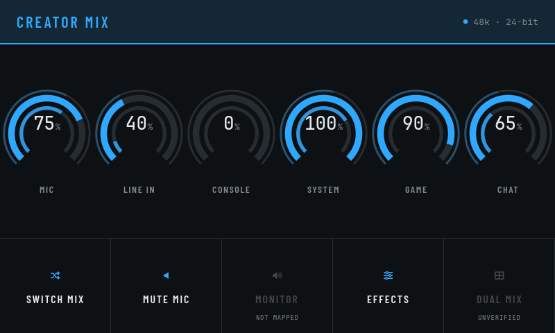
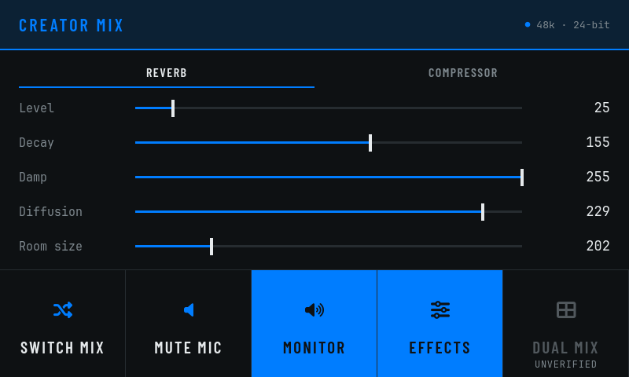
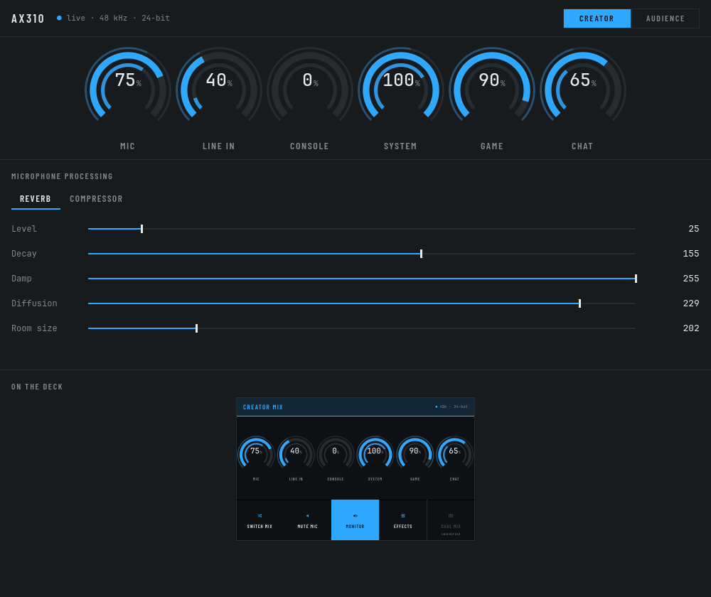

# ax310

[](https://github.com/christianparpart/ax310/actions/workflows/ci.yml)

A C++23 userspace driver and Qt/QML interface for the **AVerMedia Live Streamer
AX310** audio control deck, on Linux.

> ### ⚠ Early development
>
> This is a reverse-engineering project in progress, published so the work is
> visible rather than because it is finished. The protocol is only partly mapped,
> interfaces change without notice, and **attaching to a deck is not
> side-effect-free** — see [Building](#building). Do not point it at hardware
> somebody is streaming with.
>
> What is here is tested: 138 tests, none of which need the deck. What is missing
> is listed honestly throughout, and in [`docs/todo.md`](docs/todo.md).

**Website:** <https://christianparpart.github.io/ax310/> — including the
[wire specification](https://christianparpart.github.io/ax310/wire-protocol.html).

The AX310 is a six-knob mixing deck with a 5″ touch panel, sold with Windows and
macOS software and no Linux support. Its USB protocol is undocumented. This
project reverse-engineers it and builds an open replacement for the vendor's app.

## What works

| | |
| --- | --- |
| **Mixer** | six tracks × two independent mixes, read and written |
| **Mix control** | creator ↔ audience switching; Single/Dual mode located, not driven |
| **Effects** | reverb and compressor parameters; equaliser and gate located |
| **Screen** | 800×480 JPEG frames pushed to the deck's panel |
| **Touch** | press / move / release, coordinates verified |
| **Knobs & buttons** | turns, pushes, capacitive touch, four function buttons |
| **Meters** | six channels decoded live from the input report |
| **Audio routing** | each mixer track as its own sink, so apps can be routed per track |

## Screenshots

Both are rendered from the real QML with no hardware attached, and regenerated
with `ax310_screenshot` — so they cannot drift from the interface without someone
noticing.

**The deck's own 800×480 touch panel**



**The same panel, showing the effects**



**The desktop window**



Each track is a ring rather than a fader, because the hardware control is a knob
inside an LED ring. The thin outer arc is the **other** mix, so both are readable
per track without switching; the inner arc is the live meter with a peak-hold tick.
Blue and orange are the deck's own LED colours for the creator and audience mixes —
they say which mix you are in, rather than being decoration.

One tile is present but inert, and says so rather than looking operable. **Dual
mix**'s register is known — `0x21` takes `0x80` for Single and `0x00` for Dual —
but the same address also selects which knob rings light, and which of the two it
is doing has never been settled on the hardware. Holding the slot means the row is
not re-cut when it is.

**Monitor** was inert too, until a capture showed there was never a register to
find: the vendor's monitor widget writes the microphone's level in the creator
mix and nothing else. Turning it off silences you in your own headphones and
leaves the audience mix alone, so the stream still hears you — which is exactly
what monitoring means, and something the driver could already do.

The effects page is built from the driver's parameter table, not written out in
QML, so a parameter located later becomes one row in `protocol::Parameters` and
appears on both screens with no interface change at all.

## Building

Needs a C++23 compiler (GCC 14+ or Clang 18+), Qt 6, CMake and Ninja. hidapi and
Catch2 are fetched automatically.

```sh
# Fedora
sudo dnf install cmake ninja-build gcc-c++ clang clang-tools-extra compiler-rt \
                 qt6-qtbase-devel qt6-qtdeclarative-devel systemd-devel libusb1-devel

cmake --preset clang-debug
cmake --build --preset clang-debug
ctest --preset clang-debug
```

Presets: `clang-debug`, `gcc-release`, `clang-asan-ubsan`, `clang-tsan`,
`clang-coverage`. All four of the first are run by CI on every push.

```sh
./out/build/clang-debug/src/ax310_app --verbose
```

`--start-minimised` opens it into the taskbar rather than onto the desktop, for
when it is being run alongside something else. Ctrl+C stops it the same way
closing the window does, so the deck gets its shutdown sequence and the settings
the handshake overwrote are put back.

Under a sanitised preset the exit leak check is skipped when the interface drew
through the GPU: the graphics driver leaks about 25 kB on this desktop with no
frame of ours in any trace, and the same session under `QT_QUICK_BACKEND=software`
reports nothing at all. That is where the check still applies, along with every
test binary.

**Attaching is not entirely side-effect-free.** Connecting replays a captured
sequence that turns out to be somebody's saved configuration rather than an
initialisation. Property registers are snapshotted and restored, but the DSP chain
has no read-back, so the equaliser and reverb settings inside that capture are
still imposed. Do not point it at a deck somebody is streaming with.

## Audio routing

The deck presents one 6-channel playback device and one 8-channel capture device;
PipeWire's default profile maps those onto a surround layout, which hides the
tracks and wastes half the channels. `scripts/setup-audio.sh` selects the Pro Audio
profile and splits them into per-track devices:

```sh
./scripts/setup-audio.sh            # install
./scripts/setup-audio.sh --remove   # put everything back
```

It installs the same two files a package installs — from `packaging/`, into the
user's own configuration directories — so the development path is a rehearsal for
the package rather than a separate thing that drifts. A third file, the udev rule,
needs root and so belongs to the package alone; without it the deck cannot be
opened at all.

| Route audio to | Capture from |
| --- | --- |
| `ax310_system` · `ax310_game` · `ax310_chat` | `ax310_creator` — what you hear |
| | `ax310_audience` — what a stream captures |
| | `ax310_mic` · `ax310_loopback` |

Every mapping was confirmed on the hardware, not inferred — first by ear, and now
by measurement:

```sh
./scripts/setup-audio.sh --identify
```

plays a tone into each sink and reads the deck's own per-track meters back:

```
  sink           answered   peaks, per knob
  ax310_system   System     1 0 0 48 0 0
  ax310_game     Game       1 0 0 0 48 0
  ax310_chat     Chat       1 0 0 0 0 48
```

`ax310_probe --meters` is the same reading, by hand. Neither can confirm a level
register: the meters are pre-fader and read the same at 0% as at 100%.

## Packaging

```sh
cmake --preset gcc-release && cmake --build --preset gcc-release
cd out/build/gcc-release && cpack -G RPM      # or -G DEB, where dpkg is
```

| | |
| --- | --- |
| `/usr/bin/ax310_app` | the application |
| `/usr/lib/udev/rules.d/70-ax310.rules` | `uaccess`, so the person at the machine can open the deck |
| `/usr/share/pipewire/pipewire.conf.d/ax310-split.conf` | the per-track devices |
| `/usr/share/wireplumber/wireplumber.conf.d/51-ax310.conf` | Pro Audio, and serial-free node names |

None of the three configuration files is optional. Without the udev rule the deck
cannot be opened; without the two fragments it presents one six-channel device
instead of six tracks.

The udev rule tags the nodes `uaccess` rather than setting mode `0666`, so logind
gives the deck to whoever is logged in at the seat and takes it away again at
logout — `0666` would hand it, microphone included, to every account on the
machine.

Build the `.deb` where `dpkg` is. CPack will produce one without it, and say so
while it does: `dpkg-shlibdeps` cannot run, so the package declares almost no
dependencies, and the architecture falls back to i386.

## Layout

```
src/ax310/    the driver — Qt-free, fully injected, no threads of its own
src/app/      the Qt layer: DeviceBridge, the application, screenshots
src/gui/      QML for the desktop window and the deck's panel
src/tools/    ax310_probe, ax310_decode — reverse-engineering tools
scripts/      capture and audio-routing scripts
packaging/    the udev rule and the two PipeWire fragments, as shipped
```

The driver takes its USB transport, clock, logger, console and event sink through
the constructor, so everything above the wire runs against fakes. Nothing writes
to stdout or stderr directly: `IConsole.cpp` is the only file that names either,
which makes what a program decides to print testable and leaves one place to keep
portable. The build enforces
the Qt-free rule: `src/ax310` links hidapi and nothing else.

## Testing

151 tests, no hardware required.

Driver tests run against a scripted `FakeHidTransport`. The **rendering tests**
drive real QML through the software scene graph with the offscreen platform, so
the whole path from wire bytes to pixels is checked without a deck, a display or a
GPU — which is what lets the interface be worked on when the machine with the deck
on it is not available.

They assert invariants rather than comparing reference images: hinting and
antialiasing differ between machines, and a reference comparison fails for reasons
that have nothing to do with the interface. What is checked is what a person would
notice — the panel is exactly the size the deck accepts, it is not blank, it stays
dark enough for a dim room, and it still renders with nothing plugged in.

The desktop window's preview of the panel is **live, not a picture**: clicking it
operates the deck, because it is a real `ScreenUI` under a scale transform. That
is what lets the panel's controls be exercised from a machine with no deck
attached, and there is a test that clicks through it.

One asks where each of the deck's touch tiles actually is, and whether the
coordinates the deck reports fall inside it — which is the question that matters,
because if a tile moves the touches land somewhere else and nobody notices until
they reach for one. On platforms whose Qt delivers synthetic pointer events, a
second half presses each tile and checks the control responds; Windows' offscreen
platform delivers none, so that half runs where it can rather than being deleted
or quietly skipped — the deck reports a touch in screen coordinates and the
application passes them through verbatim, so where a tile *looks* and where it
*is* are the same question, and it is answerable without the deck. It also checks
that a tile marked as not mapped does nothing when touched, because a control that
appears to work and does not is worse than an obviously missing one.

One runs the other way round, against the real scene graph, and skips itself
where there is no display — which includes CI. The deck's frames come from a
window the compositor never maps, grabbed through the RHI, and a component can
draw perfectly under the software renderer and not at all there. One did: the
panel shipped its first frame whole and every frame after it with the rings
missing, while the suite stayed green.

One of them listens rather than looks: Qt reports a QML defect to the message
handler and then carries on with that one binding quietly dead, so a rendering
test can pass over a screen that is printing a warning per frame. That test
installs a message handler and fails on anything Qt says.

## Documentation

| | |
| --- | --- |
| [`docs/wire-protocol.md`](docs/wire-protocol.md) | the wire specification — generated, never written |
| [`AGENT.md`](AGENT.md) | how the protocol was established, and the rules the code is held to |
| [`docs/capabilities.md`](docs/capabilities.md) | what the deck can do, against how much we have |
| [`docs/capture-session.md`](docs/capture-session.md) | how to capture the vendor software |
| [`docs/todo.md`](docs/todo.md) | what is next, in order |
| [`.agent/rules/`](.agent/rules/) | established facts, and the traps already fallen into |

## The wire specification

[`docs/wire-protocol.md`](docs/wire-protocol.md) is the register map, the report
layout, the framed commands and their parameters — and **it is not written, it is
generated**, by `ax310_spec`, from the tables in `Protocol.hpp` and `Types.hpp`
that implement the protocol.

That is deliberate, and the reason is in this repository's own history: the audio
meters were once described three different ways in three files at the same time,
and each description had been written by somebody who believed it. A document kept
alongside the code drifts from it. A document projected out of the code cannot.

Three things hold it in place:

1. **Every address, length, offset, range, default and name is read from the
   constant that implements it.** No number is typed into the generator.
2. **`ctest` fails when the committed file no longer matches the headers**, naming
   the first line that differs and the command that fixes it. CI runs it on every
   push, so a stale specification cannot merge.
3. **The claims a table cannot hold are tests.** Endianness, block contiguity,
   whether a parameter fits the body it is written into — those are `[spec]`-tagged
   cases in `Protocol_test.cpp`, so the prose fails the suite rather than merely
   becoming untrue.

```sh
ax310_spec                            # to stdout
ax310_spec --write docs/wire-protocol.md
ax310_spec --check docs/wire-protocol.md
```

The first thing that ever iterated one of those tables was the generator, and it
immediately found a phantom row: `FramedCommandNames` was declared as eleven
entries with ten written, so a nameless command `0x00` had been sitting in it.
The sparse tables now deduce their own length.

## Licence

Apache-2.0. See [`LICENSE`](LICENSE), and [`NOTICE`](NOTICE) for what this links
against and on what terms — hidapi taken under its BSD-style option, Qt 6 under
LGPL-3.0 and linked dynamically, and the two OFL-1.1 typefaces compiled into the
binary.

Not affiliated with, endorsed by, or sponsored by AVerMedia Technologies, Inc.
Their names appear here only to say which hardware this talks to, and no vendor
firmware, driver or software is included or redistributed.

The protocol was worked out by watching USB traffic between the vendor's own
software and the device — black-box observation of an interface, to interoperate
with hardware its owner already bought. Register addresses and byte layouts are
facts about that interface; what is licensed here is the code written around them.

## How it was worked out

Almost everything here came from capturing the vendor software performing **one
action at a time** and diffing against an idle baseline, then confirming each
guess on the hardware before naming anything after it.

That order matters, and the notes record where it was not followed. A register was
named after screen brightness on strong evidence from captures alone; the deck
disagreed, and it dims the knob rings. An equaliser was declared a fixed filter
bank because one slider sent nothing; a different slider proved otherwise, and the
real answer was that two of the eight sliders have no band at all.

`.agent/rules/process-traps.md` keeps that list, because the mistakes are more
reusable than the conclusions.
